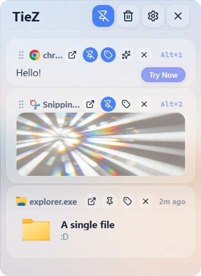
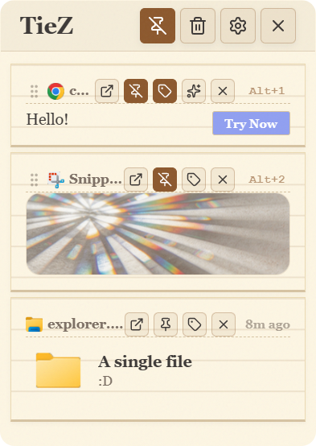
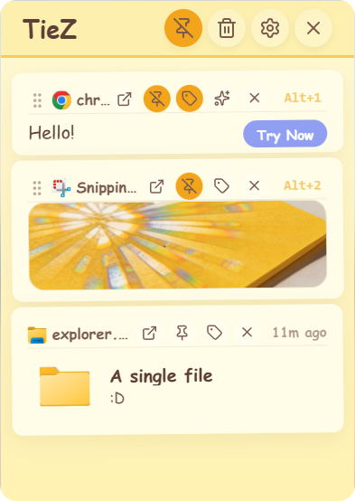
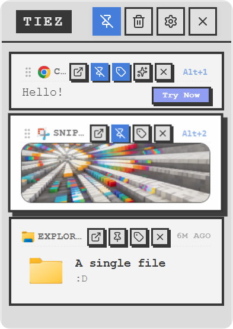
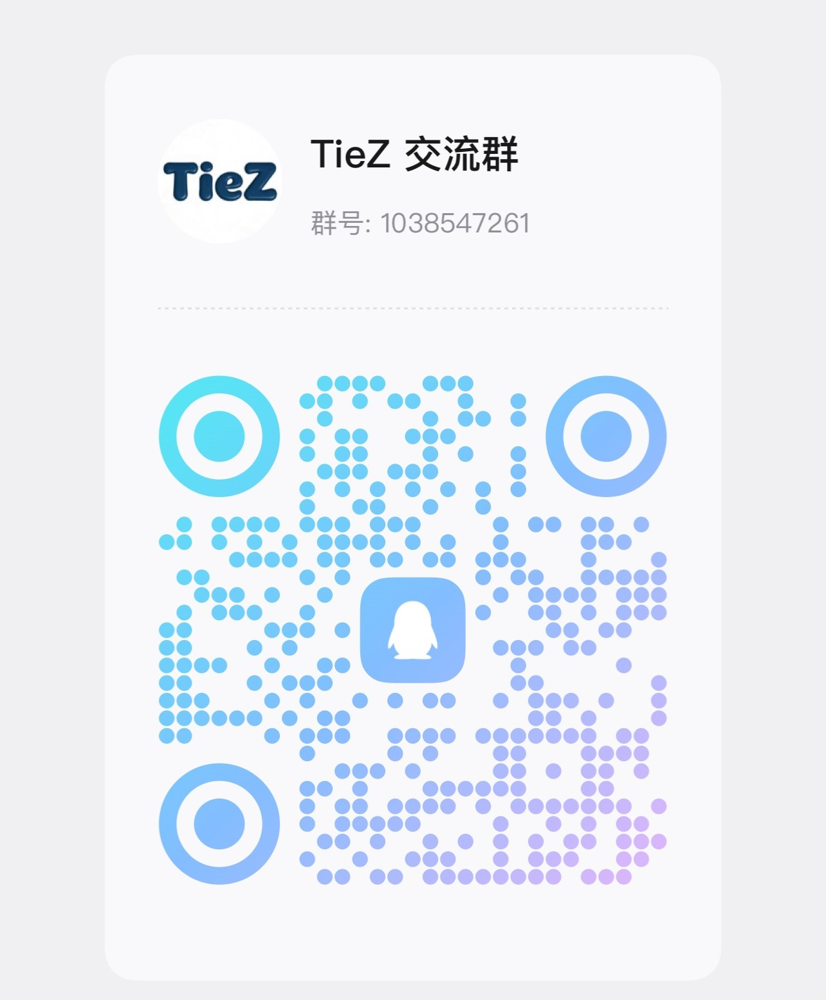

  
  <b>Making fragmented information flow effortlessly.</b>

---

  

  ### **STAY FAST. STAY SYNCED.**

  | STARS | VERSION | LICENSE | PLATFORM |
  | :--- | :--- | :--- | :--- |
  |  |  |  |  |

  [English](./README.md) | [简体中文](./README.zh-CN.md)

---

## Theme Gallery

Explore 4 elegant themes designed for every workspace and efficiency scenarios.

  <table>
    <tr>
      <td align="center"><b>Frosted Glass</b> </td>
      <td align="center"><b>Notebook Style</b> </td>
      <td align="center"><b>Sticky Note</b> </td>
      <td align="center"><b>3D Interaction</b> </td>
    </tr>
  </table>

---

## Why TieZ?

| Performance | Practicality | Privacy | Sync |
| :--- | :--- | :--- | :--- |
| **Instant Access** Native listeners and Rust core ensure absolute speed. | **Power Workflows** Rich text, tags, and AI-assisted actions. | **Local & Private** Local-first storage with smart masking for sensitive data in previews. | **Cloud Fluent** Seamless WebDAV and MQTT cross-device sync. |

---

## Key Features

### Core Experience
- **Native Efficiency**: Built with Tauri 2 and Rust for minimum memory footprint.
- **Smart Capture**: Automatically collects text, rich text (HTML), images, and file paths.
- **Modern UI**: Supports Mica/Acrylic effects and Dark/Light modes with **4 elegant theme styles**.
- **Edge Docking**: Automatically hides at the screen edge to stay out of your way.

### Management & Enhancements
- **Tag System**: Organize your history with custom multi-color tags.
- **Emoji Library**: Comprehensive built-in emoji management for quick access.
- **Advanced Settings**: Granular control over cleanup rules and app behavior.
- **Privacy Masking**: Auto-masks sensitive info like IDs and phone numbers in previews.

### Networking & Transport
- **WebDAV Sync**: Your data, your cloud. Complete cross-device history.
- **LAN File Transfer**: Seamlessly move items between devices on the same network.
- **Verifcation Code Sync**: Instant transfer of OTP codes to your active device.
- **MQTT Connectivity**: Optimized for real-time synchronization between devices.

### Productivity Tools
- **External Collaboration**: Open items in external editors with auto-sync back.
- **Global Search**: Find anything by content, source app, or date.
- **Sequential Paste**: Optimized workflow for high-frequency copy-paste tasks.

---

## Installation

### Platform Support
| Platform | Requirement | Output |
| :--- | :--- | :--- |
| **Windows** | Windows 10/11 (x86/x64) *(Windows 11 Recommended)* | `.exe` / **`.zip` (Portable)** |
| **macOS** | Sierra 10.15+  (Apple Silicon / Intel) | `.dmg` |
| **Linux** | Support Coming Soon | TBD |

[**Download the Latest Release →**](https://github.com/jimuzhe/tiez-clipboard/releases)

---

## Star History

  

---

## Community & Support

If TieZ makes your life easier, consider supporting the journey.

  <table style="border: none;">
    <tr>
      <td align="center" style="border: none;">
        
<strong>WeChat</strong>

        
      </td>
      <td align="center" style="border: none;">
        
<strong>Alipay</strong>

        
      </td>
      <td align="center" style="border: none;">
        
<strong>QQ Group</strong>

        
      </td>
    </tr>
  </table>
   
  
Your support keeps the project active and the developer caffeinated!

  <a href="https://tiez.name666.top/zh/sponsors.html"><strong>View Sponsor List</strong></a>

---

  Built with technical precision for every efficient developer.
   
  <b>Please consider leaving a Star if you find this project useful.</b>

